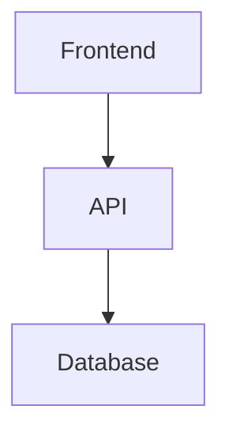

# project-relationship-audit

## Metadata

- **Status:** Active
- **Created:** 12-04-2025 18:01:03 EST
- **Last Updated:** 12-04-2025 18:11:47 EST
- **Version:** 1.1.1
- **Description:** Audit the project structure and generate Mermaid relationship diagrams plus written documentation
- **Type:** Executable Command - Used by AI agents for comprehensive project structure analysis and documentation
- **Applicability:** When onboarding a new repository, before major refactoring, or when project structure needs comprehensive documentation
- **How to Use:** Run this command to generate a canonical project structure document with Mermaid relationship diagrams under `/docs/specs/project_structure_and_relationships_v1_0.md`
- **Dependencies:** None
- **Related Cursor Commands:** [audit-project.md](./audit-project.md), [full-project-health-check.md](./full-project-health-check.md), [review-codebase.md](./review-codebase.md)
- **Related Cursor Rules:** [task-workflow.mdc](../rules/task-workflow.mdc), [documentation-metadata.mdc](../rules/documentation-metadata.mdc)
- **Related Standards:**
  - [project-planning/project-structure.md](../../standards/project-planning/project-structure.md) - Project structure validation standards
  - [project-planning/documentation-management.md](../../standards/project-planning/documentation-management.md) - Documentation organization and `/docs/specs/` structure
  - [project-planning/documentation-standards.md](../../standards/project-planning/documentation-standards.md) - Required documentation files and structure
  - [module-structure.md](../../standards/module-structure.md) - Module organization and structure standards
  - [database/schema.md](../../standards/database/schema.md) - Database schema conventions and relationships
  - [database/data-model-map-standard.md](../../standards/database/data-model-map-standard.md) - Data model mapping and relationship tracking

---

# Command: project-relationship-audit

## Purpose

Thoroughly document the current project structure and relationships, using Mermaid diagrams for all relationships. This command generates a single canonical documentation file that serves as the source of truth for project structure and relationships.

### Terminology (to avoid modules vs models confusion)

- **Modules** = code packages/components (e.g., `modules/logger`, `src/lib`, `src/services/*`). Validated against `standards/module-structure.md`.
- **Models** = data models / ORM schemas / database tables (e.g., Prisma models, SQL tables, TypeScript interfaces for domain data). Validated against `standards/database/schema.md` and `standards/database/data-model-map-standard.md`.
- Keep these distinct in inventories, diagrams, and findings.

You are a repository-aware analysis agent working INSIDE a single project. Assume the current working directory is the project root.

---

## When to Use

- When onboarding a new repository
- Before major refactoring or architectural changes
- When project structure needs comprehensive documentation
- When relationships between modules/components are unclear
- Before adding new features to understand existing architecture
- For periodic project health documentation

---

## Prerequisites

- [ ] Current working directory is the project root
- [ ] Read access to all project files
- [ ] Ability to create files in `/docs/specs/` directory (will be created if missing)
- [ ] Understanding of project's technology stack (Node.js, Python, etc.)

---

## Execution Steps

### A. Discover Project Structure & Context

#### Step 1: Locate Key Directories and Files

**Reference Standards:**

- `standards/project-planning/project-structure.md` Section 2-3 - Root directory and core directory standards
- `standards/project-planning/documentation-management.md` Section 3 - Required file structure under `/docs`
- `standards/project-planning/documentation-standards.md` Section 3 - Complete documentation subfolder structure

**Identify:**

- `src/` (or equivalent app root: `app/`, `services/`, etc.) - See `standards/project-planning/project-structure.md` Section 3.1
- `docs/` (and especially `/docs/specs/`) - See `standards/project-planning/documentation-standards.md` Section 3
- `.cursor/` - AI Agent rules and commands location
- Any `modules/`, `packages/`, or sub-services (`frontend/`, `backend/`, `worker/`, etc.) - See `standards/module-structure.md`

**Actions:**

- Use `list_dir` to explore project structure
- Validate against `standards/project-planning/project-structure.md` requirements
- Check for common directory patterns per standards
- Note if `/docs` or `/docs/specs` does not exist (documentation gap per `standards/project-planning/documentation-standards.md`)
- Plan to create output file path under `/docs/specs/` per `standards/project-planning/documentation-management.md` Section 3

#### Step 2: Scan for Existing Documentation

**Reference Standards:**

- `standards/project-planning/documentation-standards.md` Section 2 - Core foundation documents
- `standards/project-planning/documentation-standards.md` Section 3 - Complete documentation subfolder structure

**Look for:**

- Root-level `README.md` (required per `standards/project-planning/documentation-standards.md` Section 2.1)
- `docs/TECH_STACK.md` (required per `standards/project-planning/documentation-standards.md` Section 2.2)
- `docs/Roadmap_vX.X.md` (recommended per `standards/project-planning/documentation-standards.md` Section 2.2)
- Any architecture or design docs (e.g., `docs/architecture/`, `docs/specs/`, `docs/*structure*`, `docs/*overview*`)
- Existing project structure documentation
- `data_model_map.json` (if exists, per `standards/database/data-model-map-standard.md` Section 2.1)

**Actions:**

- Read existing documentation files
- Validate against `standards/project-planning/documentation-standards.md` requirements
- Use existing docs as hints, but **do not assume they are correct** if code disagrees
- Note discrepancies between documentation and actual code structure
- Check if `data_model_map.json` exists and reference it for data model relationships

#### Step 3: Determine Project Type(s)

Identify whether this project includes:

- Backend API (REST/GraphQL) and its framework
- Frontend (React/Next/Vite/etc.)
- Background workers / schedulers
- Database layer (Prisma, ORM models, SQL migrations)
- External services (Supabase, TradeStation, OpenAI, Slack, etc.)

**Actions:**

- Check `package.json` or `requirements.txt` for dependencies
- Look for framework-specific configuration files
- Identify service integrations from code imports

---

### B. Build a Component & Relationship Inventory

#### Step 4: Identify Major Components

**Reference Standards:**

- `standards/module-structure.md` Section 2 - Standard directory structure for modules
- `standards/project-planning/project-structure.md` Section 3.1 - Application code structure

For each **high-level component**, capture:

- Name and path (e.g., `src/api`, `src/services/trading`, `src/components/ui`)
- Core responsibility (1–2 sentences)
- Validation against module structure standards (if applicable)

**Components to include:**

- Modules / packages (e.g., `modules/logger`, `modules/settings-manager`) - Validate against `standards/module-structure.md`
- Services (e.g., `trading-bot`, `ai-orchestrator`, `web-app`)
- Domain layers (e.g., `src/domain`, `src/usecases`)
- Shared utilities (e.g., `src/lib`, `src/utils`)
- **Do not list data models here** (data models/ORM/DB tables are handled in Step 5)

**Actions:**

- Use `codebase_search` to find major components
- Use `grep` to find import patterns
- Validate module structure against `standards/module-structure.md` requirements (README.md, index.ts, package.json)
- Build a comprehensive list of all major components

#### Step 5: Map Detailed Structures

**Reference Standards:**

- `standards/database/data-model-map-standard.md` Section 3 - JSON schema structure for data models
- `standards/database/schema.md` Section C - Database schema conventions and relationships
- `standards/module-structure.md` Section 3.2 - index.ts public API requirements

Within each major component, list (separating code modules from data models):

- Key classes (name, file, main responsibility)
- Important functions (especially exported/entry-point functions) - Validate against `standards/module-structure.md` Section 3.2
- Key data models (TypeScript types/interfaces, ORM models, DB tables) - Reference `data_model_map.json` if exists (per `standards/database/data-model-map-standard.md`); **these are models, not modules**
- Important API endpoints (routes + handler modules)
- Database tables and relationships (if applicable) - Reference `standards/database/schema.md` for schema conventions

**Actions:**

- Read key files in each component
- Focus on exported/public APIs per `standards/module-structure.md` Section 3.2
- Check for `data_model_map.json` and use it as source of truth for data model relationships
- Validate database schema against `standards/database/schema.md` requirements (COMMENT ON, naming conventions)
- Do NOT list every trivial helper; focus on what matters for understanding and debugging

#### Step 6: Determine Relationships

Identify:

- Which modules import which others
- Which services depend on which shared utilities
- Which classes/functions are central entry points vs. internal helpers
- Which components talk to the database or external APIs
- Frontend ↔ backend API surface

**Actions:**

- Use `grep` to find import/require statements
- Trace dependency chains
- Map data flow between components
- Treat this as the **source of truth** for constructing diagrams

---

### C. Diagramming Standard – Mermaid ONLY

#### Step 7: Use Mermaid for ALL Relationship Diagrams

**Requirements:**

- Every structural/relationship diagram MUST be Mermaid
- Valid diagram types:
  - `graph TD` or `graph LR` for module/service dependency graphs
  - `classDiagram` for key classes and data models
  - `flowchart` or `sequenceDiagram` for key flows (e.g., request lifecycle, trading signal flow)
- Do **not** use PlantUML, Graphviz DOT, or images

#### Step 8: Generate Required Diagrams

At minimum, generate the following Mermaid diagrams:

**8.1 High-Level Architecture Overview**

- A `graph TD` or `graph LR` diagram showing:
  - Major services (frontend, backend, worker, DB, external APIs)
  - Direction of data/control flow between them

**8.2 Module / Package Dependency Graph**

- A `graph` diagram showing:
  - Core modules and how they depend on each other
  - Example nodes: `api`, `domain`, `infra`, `modules/logger`, `modules/settings-manager`

**8.3 Domain-Class & Data Model Diagram (if OO or ORM is present)**

- A `classDiagram` showing:
  - Key domain entities
  - Key relationships (association, composition, inheritance where meaningful)
  - Include attributes only if they help understanding; keep it readable

**8.4 Key Flow Diagram(s)**

- For at least one critical flow in this project (e.g., "incoming API request", "trade signal → order placement", "user signup"), create:
  - A `sequenceDiagram` **or**
  - A `flowchart` that traces the steps across modules/services

#### Step 9: Format Diagrams

**Formatting rules:**

- Wrap each diagram in a Markdown code block:

````markdown

````

````

- Keep diagrams **readable**, not exhaustive:
  - Group low-level functions into higher-level nodes where possible
  - Prefer clear names over file-path soup

---

### D. Write the Canonical Project Structure Doc

#### Step 10: Choose Output Path and Filename

**Reference Standards:**
- `standards/project-planning/documentation-management.md` Section 3 - Required file structure under `/docs`
- `standards/project-planning/documentation-standards.md` Section 3 - Complete documentation subfolder structure (specs folder)
- `standards/project-planning/documentation-management.md` Section 4.1 - Standard format for documentation files

**Target file (create or overwrite as needed):**
- `/docs/specs/project_structure_and_relationships_v1_0.md`
- Location aligns with `standards/project-planning/documentation-standards.md` Section 3 (`/docs/specs/` for technical specifications)

**If `/docs/specs` does not exist:**
- Create the necessary folder path according to `standards/project-planning/documentation-management.md` Section 3
- Follow folder structure defined in `standards/project-planning/documentation-standards.md` Section 3

#### Step 11: Add Required Metadata Block

**Reference Standards:**
- `standards/project-planning/documentation-management.md` Section 4.1 - Standard format for documentation files
- `.cursor/rules/date-time.mdc` Section 3 - Date format standards (authoritative source)

At the top of the file, include metadata per `standards/project-planning/documentation-management.md` Section 4.1:

```markdown
# Project_Structure_And_Relationships_v1.0

## Metadata

- **Created:** MM-DD-YYYY HH:MM:SS EST
- **Last Updated:** MM-DD-YYYY HH:MM:SS EST
- **Version:** 1.0
- **Description:** Canonical overview of the project structure and relationships, including Mermaid diagrams for all key components.
````

**Note:** For date format and command to get current timestamp, see `.cursor/rules/date-time.mdc` Section 3 (authoritative source for all date formats).

- Update `Last_Updated` when regenerating this doc in the future (use EST timezone format)
- Bump version number (`v1.1`, `v1.2`, etc.) when making meaningful structural updates per `standards/project-planning/documentation-management.md` Section 4.1

#### Step 12: Document Structure

The document MUST contain at least these sections:

**12.1 `## 1. High-Level Overview`**

- Short description of:
  - What this project is
  - Major services and responsibilities
  - Any notable constraints or design themes

**12.2 `## 2. Component Inventory`**

- Table or bullet list of major components:
  - Name
  - Path
  - Responsibility
  - Depends on (high-level list)
- This is derived from the inventory you built in Section B

**12.3 `## 3. Architecture Diagram (Mermaid)`**

- Include the high-level architecture Mermaid diagram
- Add a short paragraph explaining how to read it

**12.4 `## 4. Modules & Dependencies`**

- **Reference Standards:**
  - `standards/module-structure.md` Section 2 - Standard directory structure for modules
  - `standards/module-structure.md` Section 3 - File requirements (README.md, index.ts, package.json)
- Short narrative of how **code modules** are structured (e.g., layered architecture, feature-based) — modules ≠ models
- Validate module structure against `standards/module-structure.md` requirements
- Include the module dependency Mermaid diagram
- Call out any problematic dependencies (e.g., circular imports, feature modules reaching across layers)
- Note modules missing required files per `standards/module-structure.md` (README.md, index.ts, package.json)

**12.5 `## 5. Domain & Data Model Relationships`**

- **Reference Standards:**
  - `standards/database/data-model-map-standard.md` - Data model mapping structure
  - `standards/database/schema.md` Section C - Database schema conventions and relationships
- For projects with domain models or database tables:
  - Check if `data_model_map.json` exists (per `standards/database/data-model-map-standard.md` Section 2.1)
  - If exists, reference it as the source of truth for data model relationships
  - Explain the key entities and relationships in plain language
  - Include the `classDiagram` or similar Mermaid diagram mapping:
    - Entities / tables
    - Relationships (one-to-many, many-to-many, etc.)
  - Validate against `standards/database/schema.md` requirements (COMMENT ON descriptions, naming conventions)
- Note any unclear or under-documented **models** (do not mix with modules)
- If `data_model_map.json` is missing, recommend creating it per `standards/database/data-model-map-standard.md`

**12.6 `## 6. Key Flows`**

- Choose 1–3 critical flows (e.g., onboarding, order execution, webhook processing)
- For each:
  - Brief textual explanation
  - Mermaid `sequenceDiagram` or `flowchart` showing the path across modules/services
  - Note where errors are handled, where state is stored, and what external systems are touched

**12.7 `## 7. Identified Issues & Risks`**

- **Reference Standards for Validation:**
  - `standards/project-planning/project-structure.md` - Project structure violations
  - `standards/module-structure.md` - Module structure violations
  - `standards/database/schema.md` - Database schema violations
  - `standards/project-planning/documentation-standards.md` - Missing documentation
- Group issues into categories:
  - **Architecture** (tight coupling, circular dependencies) - Validate against `standards/project-planning/project-structure.md`
  - **Module Structure** (missing README.md, index.ts, package.json) - Validate against `standards/module-structure.md`
  - **Database Schema** (missing COMMENT ON, improper naming) - Validate against `standards/database/schema.md`
  - **Data Model Mapping** (missing `data_model_map.json`) - Validate against `standards/database/data-model-map-standard.md`
  - **Documentation** (missing READMEs, unclear modules, missing `/docs/specs/`) - Validate against `standards/project-planning/documentation-standards.md`
  - **Maintainability** (god files, missing abstractions)
  - **Testing** (critical flows with no tests)
  - **Performance or scalability concerns** (if obvious from structure)
- For each, describe:
  - What the issue is
  - Where it lives (file/module)
  - Why it matters
  - Which standard it violates (with reference)

**12.8 `## 8. Recommended Improvements & Next Steps`**

- Provide a **prioritized** list of suggested improvements:
  - High priority: structural issues that will break things or block future work
  - Medium priority: refactors that significantly improve maintainability
  - Low priority: nice-to-have cleanups and documentation upgrades
- Write these as checkable items suitable for a task system (Notion / GitHub issues)

---

### E. Constraints & Behaviour

#### Step 13: No Code Changes

**CRITICAL:**

- Do NOT modify or refactor code as part of this command
- Only:
  - Read code and docs
  - Create or update the documentation file under `/docs/specs/`
  - (Optionally) suggest follow-up tasks in the "Recommended Improvements" section

#### Step 14: Mermaid-Only Diagrams

**CRITICAL:**

- Absolutely no PNG/SVG/image export logic
- Only text-based Mermaid inside Markdown code blocks

#### Step 15: When in Doubt, Be Explicit

If a relationship or dependency is ambiguous, you may:

- Call it out in the doc as "unclear" or "inferred"
- Do not invent behavior not supported by the code

#### Step 16: Optional Follow-Up Integration

If other commands exist (e.g., `audit-project`, `full-project-health-check`, Notion task rules), you may:

- Suggest that follow-up tasks be created there
- But the primary output of THIS command is the single canonical structure doc plus its Mermaid diagrams

---

## Expected Output

### Success Case

```
✅ Project Relationship Audit complete.

Generated Documentation:
- Path: /docs/specs/project_structure_and_relationships_v1_0.md
- Diagrams Created: 4 Mermaid diagrams
  - High-Level Architecture Overview
  - Module Dependency Graph
  - Domain & Data Model Diagram
  - Key Flow Diagram (API Request Lifecycle)

Summary of Findings:
- ⚠️ High Priority: Circular dependency detected between modules/auth and modules/user-service
- ⚠️ Medium Priority: Missing README.md in src/services/trading
- ⚠️ Low Priority: Large file detected: src/utils/helpers.ts (450 lines)

This document is now the source of truth for project structure and relationships.
```

### Failure Case

```
❌ Project Relationship Audit failed.

Issues:
- Cannot read project structure: Permission denied
- Missing required directories: /docs/specs/ does not exist and cannot be created

Cannot proceed until issues are resolved.
```

---

## Validation

After generating the documentation, verify:

- [ ] `/docs/specs/project_structure_and_relationships_v1_0.md` exists
- [ ] All required sections (1-8) are present
- [ ] At least 4 Mermaid diagrams are included
- [ ] All diagrams are properly formatted in Markdown code blocks
- [ ] Metadata block is present at the top of the document
- [ ] Component inventory is comprehensive
- [ ] Issues and risks are documented
- [ ] Recommended improvements are prioritized

---

## Related Files

- **Commands:**
  - [audit-project.md](./audit-project.md) - Project structure validation against standards
  - [full-project-health-check.md](./full-project-health-check.md) - Comprehensive project health audit
  - [review-codebase.md](./review-codebase.md) - Codebase review and analysis
- **Rules:**
  - [task-workflow.mdc](../rules/task-workflow.mdc) - Development workflow integration
  - [documentation-metadata.mdc](../rules/documentation-metadata.mdc) - Documentation metadata standards
- **Standards:**
  - [project-planning/project-structure.md](../../standards/project-planning/project-structure.md) - Project structure validation standards
  - [project-planning/documentation-management.md](../../standards/project-planning/documentation-management.md) - Documentation organization and `/docs/specs/` structure
  - [project-planning/documentation-standards.md](../../standards/project-planning/documentation-standards.md) - Required documentation files and structure
  - [module-structure.md](../../standards/module-structure.md) - Module organization and structure standards
  - [database/schema.md](../../standards/database/schema.md) - Database schema conventions and relationships
  - [database/data-model-map-standard.md](../../standards/database/data-model-map-standard.md) - Data model mapping and relationship tracking

---

## Notes

- **This command is read-only:** It does not modify code, only generates documentation
- **Mermaid diagrams only:** No image exports or other diagram formats
- **Canonical source:** The generated document becomes the source of truth for project structure
- **Version management:** Update version number in filename and metadata when regenerating with structural changes
- **Comprehensive analysis:** Takes time to thoroughly analyze the codebase; be patient during execution
- **Follow-up actions:** Use recommended improvements section to create tasks in Notion or GitHub issues

---

## Final Response Format

When this command finishes, respond with a short summary:

- Path of the generated/updated doc (e.g., `/docs/specs/project_structure_and_relationships_v1_0.md`)
- Count of Mermaid diagrams created
- A 3–5 bullet summary of the highest-risk structural issues found
- A note that this doc is the **source of truth** for project structure and relationships going forward
